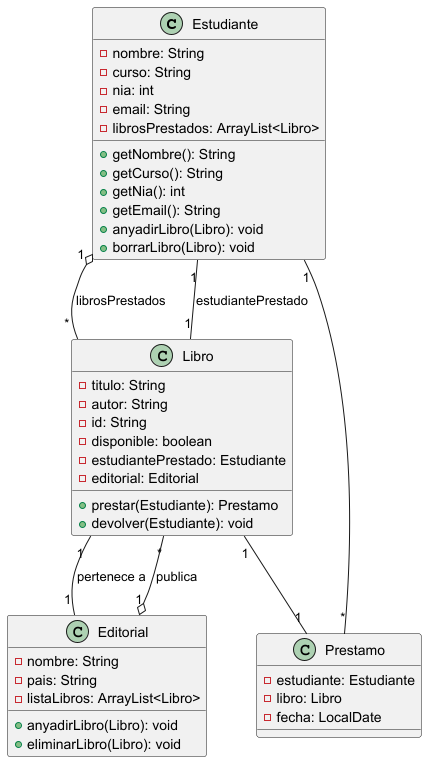

# Práctica: Servicio de compra online en MERCADAM


## ÍNDICE

1. [Resumen](#resumen)
2. [Estructura de clases](#estructura-de-clases)
   - [Diagrama de clases UML](https://github.com/pbendom3/Estructuras_datos_DAM/blob/main/README.md#diagrama-de-clases-uml)
   - [Código PlantUML](https://github.com/pbendom3/Estructuras_datos_DAM/tree/main#c%C3%B3digo-plantuml)
   - [Contenido de las clases](https://github.com/pbendom3/Estructuras_datos_DAM/tree/main#contenido-de-las-clases)
4. [Programa principal](#programa-principal)
5. [Pruebas](#pruebas)
6. [Entrega](#entrega)


## Resumen
> Este proyecto consiste en una app de compra online para un supermercado ficticio llamado **MERCADAM**.

El programa se divide en dos partes:
- **App de gestión**: crear clientes y productos.
- **App de zona de clientes**: autenticación, selección de productos y realización de pedidos.

## Estructura de clases

El programa sigue el paradigma de **Programación Orientada a Objeto (POO)** y se basa en la siguiente estructura:

### Diagrama de Clases UML



### Código PlantUML

``` PlantUML
@startuml
class Estudiante {
  - nombre: String
  - curso: String
  - nia: int
  - email: String
  - librosPrestados: ArrayList<Libro>
  + getNombre(): String
  + getCurso(): String
  + getNia(): int
  + getEmail(): String
  + anyadirLibro(Libro): void
  + borrarLibro(Libro): void
}

class Libro {
  - titulo: String
  - autor: String
  - id: String
  - disponible: boolean
  - estudiantePrestado: Estudiante
  - editorial: Editorial
  + prestar(Estudiante): Prestamo
  + devolver(Estudiante): void
}

class Prestamo {
  - estudiante: Estudiante
  - libro: Libro
  - fecha: LocalDate
}

class Editorial {
  - nombre: String
  - pais: String
  - listaLibros: ArrayList<Libro>
  + anyadirLibro(Libro): void
  + eliminarLibro(Libro): void
}

Estudiante "1" o-- "*" Libro : librosPrestados
Libro "1" -- "1" Estudiante : estudiantePrestado
Libro "1" -- "1" Prestamo
Estudiante "1" -- "*" Prestamo
Libro "1" -- "1" Editorial : pertenece a
Editorial "1" o-- "*" Libro : publica

@enduml

```
### Contenido de las clases

**Clase Cliente**

[Link a la clase](https://github.com/pbendom3/Estructuras_datos_DAM/blob/main/estructuras/src/main/java/org/example/equals_hashcode/Paciente.java)

```` Java
package org.example.comparadores;

import lombok.Getter;

import java.util.Objects;

@Getter
public class Producto {//implements Comparable<Producto>{

    private String nombre;
    private Integer precio;

    public Producto (String nombre, int precio){
        this.nombre=nombre;
        this.precio=precio;
    }

    @Override
    public String toString() {
        return "Producto{" +
                "nombre='" + nombre + '\'' +
                ", precio=" + precio +
                '}';
    }

    @Override
    public boolean equals(Object o) {
        if (this == o) return true;
        if (o == null || getClass() != o.getClass()) return false;
        Producto producto = (Producto) o;
        return precio == producto.precio && Objects.equals(nombre, producto.nombre);
    }

    @Override
    public int hashCode() {
        return Objects.hash(nombre, precio);
    }

//    @Override
//    public int compareTo(Producto producto) {
//
//        int comparacionNombre = nombre.compareTo(producto.nombre);
//
//        if (comparacionNombre != 0){
//            return comparacionNombre;
//        }
//
//        return precio.compareTo(producto.precio);
//
//    }

}

````

Explicación técnica...

## Programa principal: AppZonaClientes

> [!NOTE]
> Useful information that users should know, even when skimming content.

> [!TIP]
> Helpful advice for doing things better or more easily.

> [!IMPORTANT]
> Key information users need to know to achieve their goal.

> [!WARNING]
> Urgent info that needs immediate user attention to avoid problems.

> [!CAUTION]
> Advises about risks or negative outcomes of certain actions.

## Pruebas


## Entrega
- [x] **Código fuente**: [Enlace a GitHub](https://github.com/pbendom3/Estructuras_datos_DAM/blob/main/estructuras/src/main/java/org/example/equals_hashcode/Paciente.java)
- [ ] **Vídeo demostrativo**: [Enlace al vídeo](https://www.youtube.com/?gl=ES&hl=es)
@pbendom3


